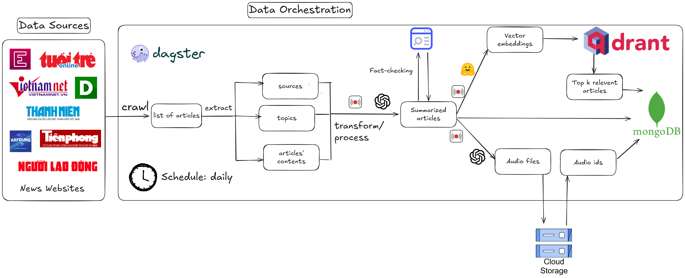

# Briefly AI Pipeline

This is a [Dagster](https://dagster.io/) project that implements an automated news processing pipeline for collecting, processing, summarizing, and converting Vietnamese news articles to audio.



## Project Overview

Briefly AI is a data orchestration pipeline that:
1. Crawls Vietnamese news websites for articles
2. Extracts article content and metadata
3. Processes and transforms the articles
4. Generates summaries using AI
5. Creates audio versions of the articles
6. Stores processed data in MongoDB and cloud storage
7. Ranks articles by relevance using vector embeddings

## Getting Started

First, install your Dagster code location as a Python package. By using the --editable flag, pip will install your Python package in ["editable mode"](https://pip.pypa.io/en/latest/topics/local-project-installs/#editable-installs) so that as you develop, local code changes will automatically apply.

```bash
pip install -e ".[dev]"
```

Then, start the Dagster UI web server:

```bash
dagster dev
```

Open http://localhost:3000 with your browser to see the project.

You can start writing assets in `news_pipeline/assets.py`. The assets are automatically loaded into the Dagster code location as you define them.

## Pipeline Assets

The pipeline processes the following assets:
- RSS feed metadata
- Raw articles
- Cleaned articles
- Summarized articles
- Audio files

## Development

### Adding new Python dependencies

You can specify new Python dependencies in `setup.py`.

### Unit testing

Tests are in the `news_pipeline_tests` directory and you can run tests using `pytest`:

```bash
pytest news_pipeline_tests
```

### Schedules and sensors

If you want to enable Dagster [Schedules](https://docs.dagster.io/guides/automate/schedules/) or [Sensors](https://docs.dagster.io/guides/automate/sensors/) for your jobs, the [Dagster Daemon](https://docs.dagster.io/guides/deploy/execution/dagster-daemon) process must be running. This is done automatically when you run `dagster dev`.

Once your Dagster Daemon is running, you can start turning on schedules and sensors for your jobs. The pipeline is configured to run on a daily schedule.

## Architecture Components

- **Data Sources**: Vietnamese news websites including VnExpress, Tuoi Tre, VietnamNet, and others
- **Data Orchestration**: Dagster for workflow management
- **Processing**: Transformation of raw articles into structured data
- **AI Features**:
  - Text summarization 
  - Fact-checking
  - Vector embeddings for semantic search
  - Text-to-speech conversion
- **Storage**: MongoDB for document storage and Cloud Storage for audio files
- **Ranking**: Top k relevant articles using Qdrant vector database

## Deploy on Dagster+

The easiest way to deploy your Dagster project is to use Dagster+.

Check out the [Dagster+ documentation](https://docs.dagster.io/dagster-plus/) to learn more.
